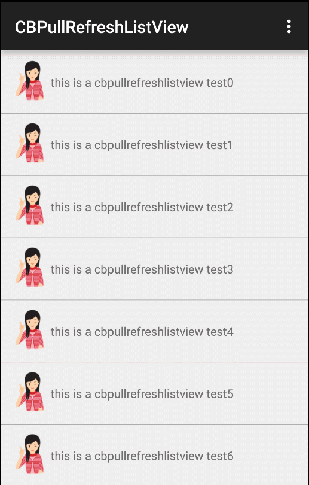
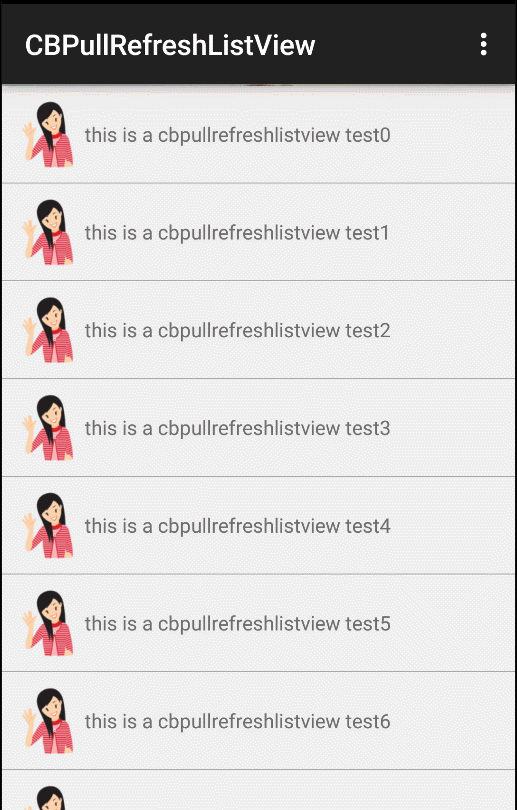

## CBPullRefreshListView
下拉刷新很常见，listview带侧滑功能的也很常见。github上将两者结合的也很多比如：[SwipeMenuListView](https://github.com/baoyongzhang/SwipeMenuListView)是带有侧滑功能的lisetview但是无法下拉刷新。而[Android-PullToRefresh-SwipeMenuListView-Sample](https://github.com/licaomeng/Android-PullToRefresh-SwipeMenuListView-Sample)是将几个功能完整结合。看了下他们的实现，是在以前的XListView基础上整合。但listview里面的下拉刷新和上拉加载的动作与刷新头耦合比较严重。如果想自定义自己的刷新头样式稍微麻烦点。于是就想把下拉刷新的功能和刷新头的展示样式抽离分开。listview只管将一些下拉上拉的事件传递出来。刷新头通过实现这些状态方法去做自己想要的刷新样式就可以了。 
 
 

自定义刷新头
---
继承CBRefreshHeaderView 实现几个状态下的回调的方法比如：

    /**
     * 设置当前状态
     * @param state
     */
    @Override
    public void setState(int state) {

    }
    /**
     * 下拉刷新的回调
     */
    @Override
    public void pullToRefresh() {

    }
    /**
     * 释放刷新的回调
     */
    @Override
    public void releaseToRefresh() {

    }
    /**
     * 正在刷新
     */
    @Override
    public void onRefreshing() {

    }
    /**
     * 设置头部或底部的可见高度
     * @param height
     */
    @Override
    public void setVisiableHeight(int height) {

    }
    /**
     * 获取可见高度
     * @return
     */
    @Override
    public int getVisiableHeight() {
        return 0;
    }
    /**
     * 正在拖动
     * @param deltaY
     */
    @Override
    public void onDragSlide(float deltaY) {

    }

在这些方法中去改变刷新头不同状态下的表现形式。（下拉刷新是通过改变头部高度实现的）可以参考CBRefreshHeader MyCustomRrefreshHeader  有哪些状态回调可以查看 CBRefreshState

CBPullRefreshListView一些其他方法：
---
设置自定义的刷新头
-
    mListView.setRefreshHeader(myRefreshHeader);
    
设置是否显示顶部的搜索栏（可自定义）
-
    mListView.showTobSearchBar(true);
    mListView.setTopSearchBar(myTopSearchBar);

设置下拉刷新的监听接口
-
    mListView.setOnPullRefreshListener(new CBPullRefreshListView.OnPullRefreshListener() {
            @Override
            public void onRefresh() {
                mListView.postDelayed(new Runnable() {
                    @Override
                    public void run() {
                        mListView.stopRefresh();
                    }
                }, 3000);
            }

            @Override
            public void onLoadMore() {
                mListView.postDelayed(new Runnable() {
                    @Override
                    public void run() {
                        mListView.stopLoadMore();
                    }
                }, 3000);
            }

            @Override
            public void onUpdateRefreshTime(long time) {

            }

        });

设置侧滑菜单项目
-

    SwipeMenuCreator creator = new SwipeMenuCreator() {

            @Override
            public void create(SwipeMenu menu) {

                SwipeMenuItem collectionItem = new SwipeMenuItem(getApplicationContext());
                collectionItem.setBackground(R.color.green);
                collectionItem.setWidth(dp2px(CustomRefreshHeaderActivity.this, 90));
                collectionItem.setTitle("收藏");
                collectionItem.setTitleSize(18);
                collectionItem.setTitleColor(Color.WHITE);
                collectionItem.setIcon(R.drawable.icon_collection);
                menu.addMenuItem(collectionItem);

                SwipeMenuItem deleteItem = new SwipeMenuItem(getApplicationContext());
                deleteItem.setBackground(R.color.red);
                deleteItem.setWidth(dp2px(CustomRefreshHeaderActivity.this, 90));
                deleteItem.setTitle("删除");
                deleteItem.setIcon(R.drawable.icon_delete);
                deleteItem.setTitleSize(18);
                deleteItem.setTitleColor(Color.WHITE);
                menu.addMenuItem(deleteItem);
            }
        };
        mListView.setMenuCreator(creator);

设置侧滑菜单项的点击添加和listview的item点击监听

    mListView.setOnMenuItemClickListener(new CBPullRefreshListView.OnMenuItemClickListener() {
            @Override
            public void onMenuItemClick(int position, SwipeMenu menu, int index) {
                Toast.makeText(CustomRefreshHeaderActivity.this, "点击了item swipe 菜单的第" + index, Toast.LENGTH_SHORT).show();
            }
        });
    mListView.setOnItemClickListener(new CBPullRefreshListView.OnItemClickListener() {
            @Override
            public void onItemClick(AdapterView<?> parent, View view, int position, long id) {
                Toast.makeText(CustomRefreshHeaderActivity.this,"点击了"+position,Toast.LENGTH_SHORT).show();
            }
        });
